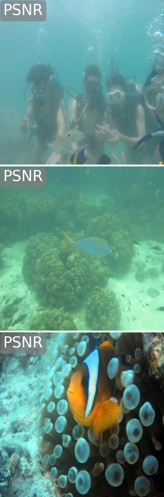
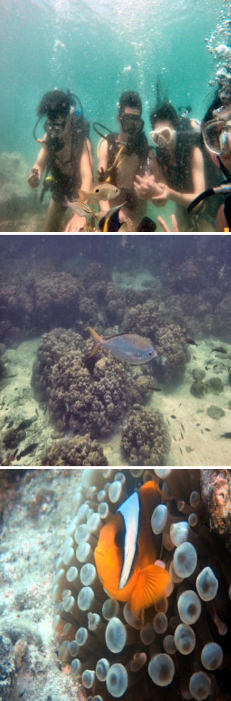
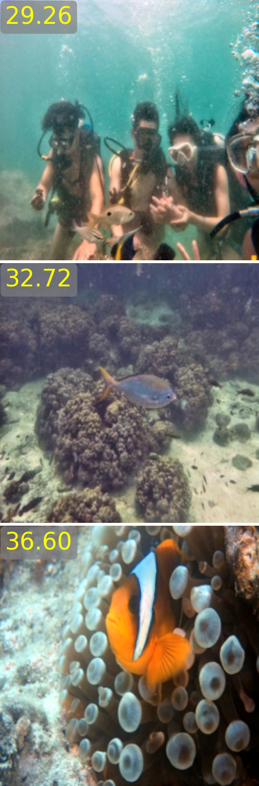

# Deep Feature Prior-Guided Conditional Diffusion Model for Underwater Image Enhancement

This repository contains the implementation of the paper
**"Deep Feature Prior-Guided Conditional Diffusion Model for Underwater Image Enhancement"**, accepted by IEEE Signal Processing Letters (SPL).
[Paper Link](https://ieeexplore.ieee.org/document/11267063)

## Qualitative Comparison

<p align="center">
  
  
  
</p>
<p align="center">
  From left to right are the input image, the ground truth, and the result of our method
</p>

## Guide
### Env Prepare
```shell
conda create -n pgd python=3.10
conda activate pgd
pip install -r requirements.txt
```

### Pretrained Model and Feature-dictionary 
base diffusion model [(stable diffusion v2.1)](https://huggingface.co/stabilityai/stable-diffusion-2-1-base)   
our pretrained model: https://pan.baidu.com/s/18byl7aRraVagl0VcKmRfDQ, password: cc9m  
feature dictionary: https://pan.baidu.com/s/128hOKWpJJ7NiXv4jXqJrUA, password: 2x42  

Remember to modify the corresponding path in the configuration file.


### Dataset Prepare
We use the form of a file list, you can create the file list by the cmd
```
find /path -f > filelist
```

### Run test
```
python test.py --config ./configs/test.yaml
```


## Acknowledgement

This project is based on [ControlNet](https://github.com/lllyasviel/ControlNet), [DiffBIR](https://github.com/XPixelGroup/DiffBIR), [SCEIR](https://github.com/charliewalker322/SCEIR-pytorch), [DMUIE](https://github.com/piggy2009/DM_underwater) and [FAISS](https://github.com/facebookresearch/faiss).   
Thanks for their awesome work.


## Citation
If you find this work useful, please consider citing our paper.

```bibtex
@ARTICLE{PGUIE,
  author={Zhu, Junhao and Zhu, Linwei and Tian, Tao and Wu, Wenhui and Cao, Jingchao},
  journal={IEEE Signal Processing Letters}, 
  title={Deep Feature Prior-Guided Conditional Diffusion Model for Underwater Image Enhancement}, 
  year={2026},
  volume={33},
  number={},
  pages={86-90},
  keywords={Dictionaries;Diffusion models;Feature extraction;Training;Noise reduction;Image restoration;Image enhancement;Image color analysis;Semantics;Imaging;Underwater image enhancement;diffusion models;feature prior},
  doi={10.1109/LSP.2025.3636452}}
```